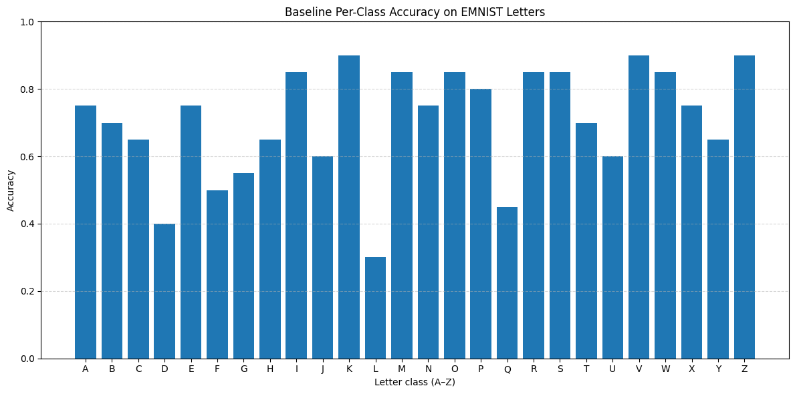
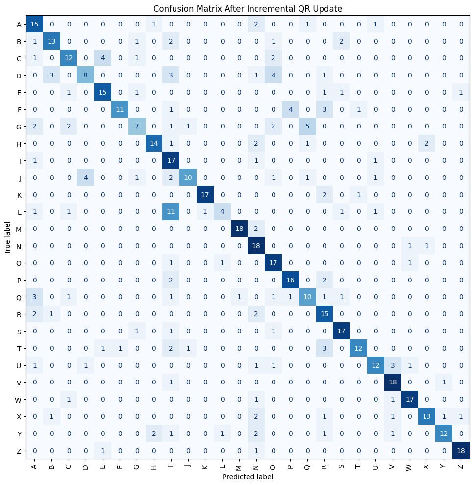
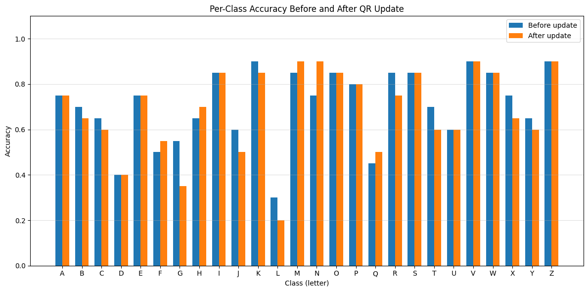

# QR-Based EMNIST Letter Classification with Incremental QR Updates

A numerical linear algebra project that uses QR factorization for nearest-subspace classification on the **EMNIST Letters** dataset and studies how an existing QR factorization can be updated when new training columns are appended.

The project combines:

- Householder QR factorization
- nearest-subspace classification
- Givens rotations
- incremental QR updates
- numerical validation against `numpy.linalg.qr`
- runtime comparison between updating and full recomputation

The complete experiment is available in [`qr_emnist_classification.ipynb`](qr_emnist_classification.ipynb).

## Dataset

The experiment uses the **EMNIST Letters** split with 26 classes (A-Z). Each 28 × 28 grayscale image is flattened into a 784-dimensional vector.

For each class:

- **200 samples** are used for the initial training matrix
- **20 additional samples** are appended during the QR-update experiment
- **20 test samples** are used for evaluation

Therefore, each initial class matrix has shape:

```text
784 × 200
```

and each updated class matrix has shape:

```text
784 × 220
```

The dataset is downloaded automatically through `torchvision` and is intentionally excluded from version control.

Dataset reference: [NIST EMNIST](https://www.nist.gov/itl/products-and-services/emnist-dataset)

## Method

### 1. Householder QR factorization

For each letter class, the training samples form a matrix \(A_i\). A full QR factorization is computed:

\[
A_i = Q_i R_i
\]

where \(Q_i\) is orthogonal and \(R_i\) is upper trapezoidal.

The implementation applies Householder reflectors directly to active matrix blocks rather than explicitly constructing a dense reflector at every step. It also includes a zero-norm guard for already-zero active column segments.

### 2. Nearest-subspace classification

For a test vector \(z\), each class is evaluated through a least-squares residual. Since \(Q_i\) is orthogonal,

\[
\|z-A_i x\|_2
=
\|Q_i^Tz-R_i x\|_2.
\]

The predicted class is the class with the smallest residual.

The implementation evaluates all test right-hand sides for each class in one least-squares solve rather than reconstructing \(A_i=Q_iR_i\) repeatedly.

### 3. Incremental QR update with Givens rotations

When a new training vector \(x\) is appended as a column, the existing factors are updated rather than discarded.

This notebook follows the Givens convention used by Hammarling and Lucas. With

\[
G =
\begin{bmatrix}
c & s\\
-s & c
\end{bmatrix},
\]

`givens(a, b)` is constructed so that

\[
G^T
\begin{bmatrix}
a\\
b
\end{bmatrix}
=
\begin{bmatrix}
d\\
0
\end{bmatrix}.
\]

Accordingly, the update applies:

```text
R <- G.T @ R
Q <- Q @ G
```

on the affected rows/columns.

The earlier version of this project mixed this `givens()` convention with the opposite application. The current implementation reconciles the convention with the source algorithm and validates the result numerically before it is used on EMNIST.

The implemented function signature is:

```python
update_qr_with_new_column(Q, R, x)
```

and multiple new columns are appended sequentially through:

```python
update_qr_with_givens(Q, R, X)
```

## Numerical validation

Before running the EMNIST update, the implementation is tested on several small random matrices.

The tests verify all of the following:

1. reconstruction:
   \[
   [A,X] \approx Q_{\text{new}}R_{\text{new}}
   \]

2. orthogonality:
   \[
   Q_{\text{new}}^TQ_{\text{new}} \approx I
   \]

3. upper-trapezoidal structure of \(R_{\text{new}}\)

4. agreement of the updated column space with `numpy.linalg.qr`

### Synthetic tests

The synthetic tests passed for all tested matrix sizes. Errors were at approximately machine precision:

| Augmented size | Reconstruction error | Orthogonality error | Triangularity error | Subspace projector error |
|---|---:|---:|---:|---:|
| 8 × 5 | 2.22e-16 | 3.28e-16 | 0.00 | 5.10e-16 |
| 12 × 8 | 5.27e-16 | 6.31e-16 | 0.00 | 7.56e-16 |
| 20 × 12 | 5.90e-16 | 6.31e-16 | 0.00 | 8.06e-16 |

### EMNIST update validation

After appending 20 new training columns per class, all 26 updated factorizations retained very small numerical errors.

Worst observed values across the 26 classes:

| Quantity | Maximum error |
|---|---:|
| Relative reconstruction error | **1.071e-15** |
| Normalized orthogonality error | **1.609e-15** |
| Relative lower-triangular leakage | **0.000** |

For class A, the augmented matrix had full column rank:

```text
rank = 220 / 220
```

The NumPy reduced-QR reconstruction error was:

```text
1.008e-15
```

and the column-space projector difference between the incremental update and NumPy QR was:

```text
7.993e-15
```

These results confirm that the corrected incremental update preserves reconstruction, orthogonality, and upper-trapezoidal structure to floating-point precision in this experiment.

## Classification results

### Baseline

Using 200 training samples per class:

```text
Overall accuracy: 70.58%
```



### After incremental QR updates

After appending 20 additional training samples per class:

```text
Overall accuracy: 68.46%
Change: -2.12 percentage points
```

The experiment therefore produced a lower classification accuracy after adding the additional samples.

No causal explanation is inferred from this result. The experiment does not isolate whether the change is due to sample composition, class overlap, model behavior, or another factor.



### Per-class comparison



Examples of per-class changes include:

- N: 75% → 90%
- M: 85% → 90%
- H: 65% → 70%
- Q: 45% → 50%
- G: 55% → 35%
- L: 30% → 20%

These differences are descriptive results from this run only.

## Runtime comparison

For one representative class, the executed notebook measured:

| Method | Runtime |
|---|---:|
| Incremental Givens update | **0.116 s** |
| Custom Householder recomputation | 0.144 s |
| NumPy complete QR | **0.014 s** |

In this Python implementation, the incremental update was about **1.25× faster than the custom Householder recomputation**, but optimized NumPy QR was substantially faster than either custom implementation.

This distinction matters: the Hammarling-Lucas update algorithms reduce arithmetic relative to recomputing a factorization, but a Python implementation containing many small rotations should not be expected to outperform optimized compiled LAPACK/BLAS routines automatically.

## Implementation scope and limitations

- A full \(784\times784\) matrix \(Q\) is stored for each of the 26 classes.
  One float64 \(Q\) matrix requires about 4.69 MiB, so the 26 cached \(Q\) matrices alone require roughly 122 MiB.
- This explicit full-\(Q\) design is useful for an educational implementation but is not memory-optimal.
- The update routine is specialized to **appending columns at the end** and to the tall regime used in this experiment.
- A factored or economy representation of \(Q\) would be more appropriate for larger-scale applications.
- Runtime comparisons are implementation- and hardware-dependent.
- Classification accuracy changes alone do not establish why performance changed.

## Reference

The numerical QR-update convention is based on:

> Sven Hammarling and Craig Lucas. **Updating the QR Factorization and the Least Squares Problem.** MIMS EPrint 2008.111, Manchester Institute for Mathematical Sciences, University of Manchester, 2008.

Official report: http://eprints.maths.manchester.ac.uk/1192/

This repository is an **educational adaptation**, not a line-for-line implementation of the paper's LAPACK-style routines. The Givens convention follows Algorithm 1.1, while the column-append update is based on the development in Section 2.5, particularly Algorithms 2.19-2.20.

## Run locally

Python 3.9 or newer is recommended.

```bash
git clone https://github.com/maryamjbr/QR-classification.git
cd QR-classification

python3 -m venv .venv
source .venv/bin/activate

python3 -m pip install -r requirements.txt
jupyter notebook qr_emnist_classification.ipynb
```

The first execution downloads the EMNIST dataset automatically.

## Repository structure

```text
.
├── assets/
│   ├── baseline-per-class-accuracy.png
│   ├── confusion-matrix-after-update.png
│   └── per-class-before-after.png
├── .gitignore
├── README.md
├── qr_emnist_classification.ipynb
└── requirements.txt
```

## Author

**Maryam Jabbari**
